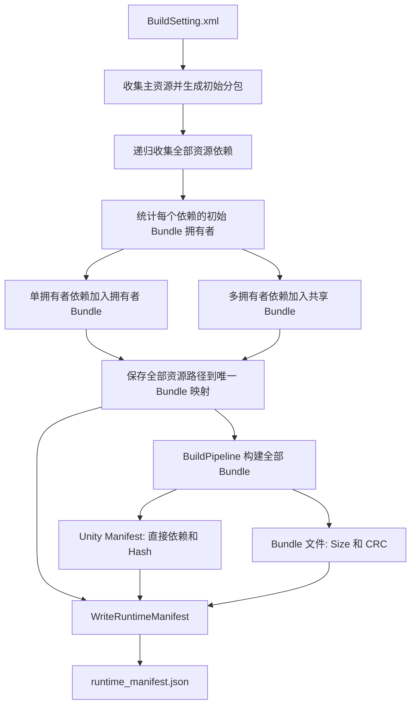
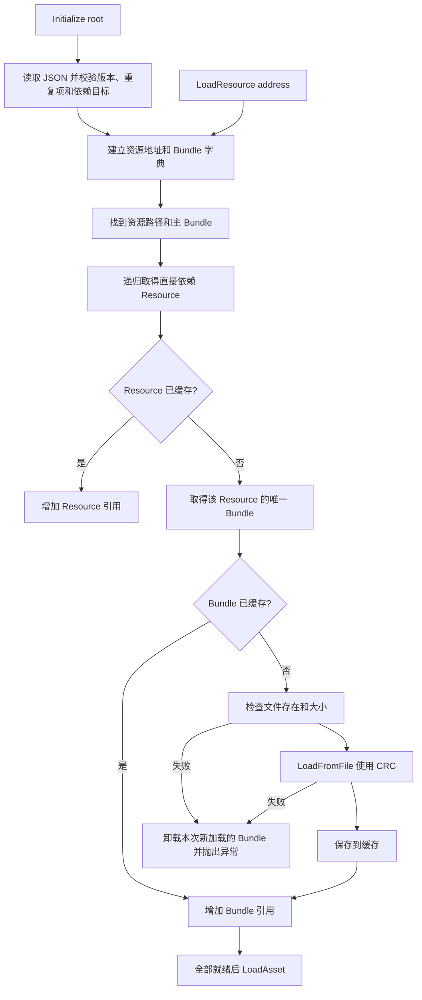

# AssetBundle 构建与加载

## 使用

1. Unity 菜单 `Build/Build Asset Bundles` 根据 `Assets/BuildSetting.xml` 打包，并在 BuildRoot 写入 v2 `runtime_manifest.json`。
2. Player 中 `ResourceManager.Initialize(root)` 读取该文件；默认 root 是 `Application.dataPath/AssetBundles`。Editor 中无参初始化默认使用 `AssetDatabase`，显式传入 root 时验证真实 Bundle。
3. address 使用完整主资源路径，例如 `LoadResource<TextAsset>("Assets/AssetBundleTest/UI/Login.txt")`。每次成功加载都会增加资源引用，使用结束后调用 `ReleaseResource(address)`。
4. `LoadResourceAsync<T>` 可直接 `await`，`LoadResourceWithCallback<T>` 和 `LoadResourceCoroutine<T>` 分别提供 Callback 与协程入口；相同地址共享同一个加载任务和资源缓存。
5. Play Mode 会自动创建隐藏驱动推进 `Update/LateUpdate`。非 Play Mode 测试异步请求时需要手动调用这两个方法。
6. `UnloadAll()` 立即清空整个管理器。`UnloadAll(true)` 会同时销毁已加载对象，只在确认没有框架外使用者时调用。

## 测试

Unity 菜单 `Build/Run Framework Tests` 运行断言测试。也支持 `-batchmode -executeMethod MyAssetBundleFramework.PackageBuilder.Editor.FrameworkTests.Run -quit`。
测试创建唯一临时资源目录和输出目录，真实构建两个共享材质的 Prefab，结束后清理自己创建的内容。测试应在没有其他管理器加载这些测试包时执行。

覆盖地址大小写和斜杠归一化、未知地址、非法相对路径、重复地址和包名、缺失依赖、版本不匹配、菱形依赖去重、递归资源依赖及 Common 分组、真实 Manifest 写出、依赖先加载、资源与 Bundle 缓存复用、引用增减、帧末延迟卸载、待卸载资源复用、Editor 直读与 Callback/Task、公共材质实例共享、卸载和重新初始化、尺寸不匹配、CRC 不匹配、缺失文件的失败回滚，以及回滚保留原有缓存。

2026-09-06 使用 Unity 6000.4.10f1 在隔离工程 `Temp/FrameworkValidation` 完成真实编译和打包测试。日志见 `Temp/framework-tests-final.log`。这验证框架自身，不等同于完整主工程的场景或目标平台验证。CRC 负向用例会产生预期的 Unity CRC 错误日志，以最终测试通过消息和进程退出码判定结果。

## 之前的不足与当前边界

| 项目 | 当前处理或后续工作 |
| --- | --- |
| Manifest 只有 DTO，没有落盘 | 已实现排序输出、最终构建结果读取和临时文件替换 |
| ResourceManager 要求调用者提供 Bundle 名 | 已增加 address 单参数加载；保留双参数入口 |
| 运行时仍依赖 Unity 总包 | 改为自定义 Manifest，JSON 与 Bundle 一起分发即可 |
| Bundle 命名压平路径、去扩展名可能冲突 | 已加入重复 Bundle 名检查；仍建议后续设计稳定命名规则 |
| 文件损坏或失败时残留已加载依赖 | 检查 Size、CRC，并回滚本次新加载的 Bundle；原有缓存保留 |
| 构建异常只打印消息 | 改为记录异常并抛出，自动构建能检测失败 |
| 资源级依赖被展平成集合 | 已改为为每个资源写入直接依赖，ManifestIndex 初始化时校验并缓存完整资源 DAG |
| 递归统计穿过已有显式 Bundle | 可能把仅因传递引用而出现的资源过度提升至 Common；可按显式归属边界改进 |
| 只筛选 Assets/ 依赖 | Packages/ 的可打包资源仍可能隐式重复，应单独设计筛选规则；不能直接将所有路径全打包 |
| Common 合并所有共享资源 | 会扩大加载和更新范围，未来按 UI、角色或生命周期拆组 |
| XML 单文件和 ResourceType 分支 | 原 FindAssetPath 仍主要按目录扫描；Depend/All 等配置没有完整语义，需要独立补齐 |
| 场景通过 LoadAsset 加载 | 当前明确拒绝 .unity；用 BundleManager 加载场景包后交给 SceneManager |
| 引用计数 | Resource 按地址计数；每个缓存 Resource 持有一次直接依赖 Resource 引用和一次自身 Bundle 引用。两层归零后依次在 LateUpdate 退出缓存；框架仍不跟踪业务实例化对象 |
| 异步加载 | 与参考实现一致，依赖 Resource 同步取得，主 Resource 的 Bundle 和 Asset 异步读取；Unity 请求不能取消，业务取消后仍需等待底层请求结束再卸载 |
| 平台与发布 | 当前文件源仍要求 `LoadFromFile/Async` 可访问的本地路径；Android 压缩 StreamingAssets 和 WebGL 需要下载或落盘适配，输出未按平台隔离 |
| 发布原子性 | JSON 替换不代表整套 Bundle 原子发布；应在独立版本目录构建成功后切换目录，避免失败构建混用旧 JSON |
| Hash | 写入用于版本比较，没有充当文件加密签名；CRC 为 0 时 Unity 跳过 CRC 校验 |
| 多个管理器 | 同一套包应使用一个长期存活的管理器，多个独立实例不会共享缓存 |

ManifestIndex 在初始化阶段检测资源与 Bundle 依赖环，发现环时拒绝加载。资源查询不到、资源缺失或类型不匹配都会抛出异常。

完整运行时架构与生命周期图见 [ResourceArchitecture.md](ResourceArchitecture.md)。
