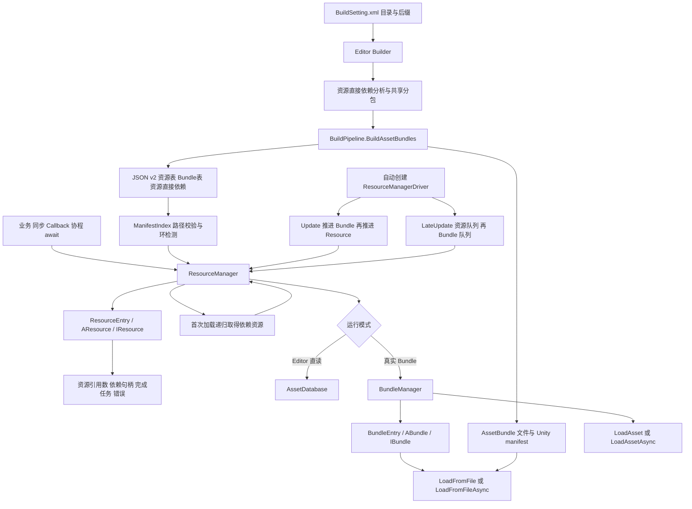
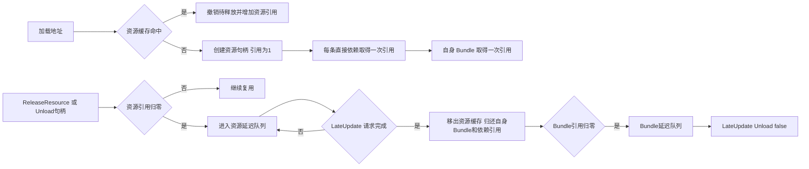

# 资源框架架构

## 构建与运行时



## 引用与释放



同一资源被业务加载两次，资源引用为2；它对依赖和自身 Bundle 的持有仍各只有一次。主资源真正退出缓存时才归还这些引用。同一 Bundle 内多个资源各持有一次 Bundle 引用。

正在异步读取的资源归零后等待底层请求完成；完成前重新加载会撤销取消标记。取消完成后重新加载会创建新句柄，并归还旧句柄持有的依赖。依赖在本轮释放中新增入队时，下一帧再处理。

## 调用示例

```csharp
var resources = new MyAssetBundleFramework.ResourceManager.ResourceManager();
resources.Initialize();
string address = "Assets/AssetBundleTest/UI/Login.txt";

TextAsset text = resources.LoadResource<TextAsset>(address);
resources.ReleaseResource(address);

IResource handle = resources.Load(address, true);
UnityEngine.Object asset = await handle;
resources.Unload(handle);

resources.LoadWithCallback(address, true, loaded =>
{
    if (loaded.Error == null)
        resources.Unload(loaded);
});
```

示例所在文件需要 `using UnityEngine;` 和 `using MyAssetBundleFramework.ResourceManager;`。await 示例放在 async 方法中。协程中可用 `yield return handle`，结束后检查 `Error` 并归还引用；泛型任务接口为 `await resources.LoadResourceAsync<TextAsset>(address)`。

Editor 无参初始化走 AssetDatabase；真实 Bundle 使用 `Initialize(absoluteBundleRoot, false)`。运行时自动驱动 Update/LateUpdate；编辑器非 Play Mode 测试需要主动推进。所有调用在 Unity 主线程执行，每次成功加载对应一次释放，await 本身不增加引用。

## 与参考实现的对应及边界

- 保留 JSON v2，而非参考实现的 manifest.ab 三份二进制表；两种格式不兼容，需要使用本工程 Builder 重新构建。
- 资源级依赖由 ResourceManager 管理，BundleManager 只持有自身包；直接使用 BundleManager 时调用者负责先加载依赖包。
- 与参考实现一致，异步主资源的依赖仍同步取得；主 Bundle 和主资产使用 Unity 异步请求。尚未实现全依赖链异步调度。
- 同步请求遇到正在异步加载的同资源或 Bundle 会抛出异常，不阻塞等待。
- 正常卸载使用 Unload(false)，不会销毁业务仍持有的 Unity 对象；退出缓存不等于所有原生资源立即回收。实例化对象由业务自行管理。
- 同一套包使用一个长期存活管理器。退出时调用 UnloadAll；它取消未完成任务，不能取消 Unity 底层 IO。
- 场景不支持 LoadAsset，需通过 SceneManager；平台路径回调、网络下载及二进制清单兼容不在此版本内。

## 验证

Unity 菜单 `Build/Run Framework Tests`：真实构建、资源依赖、共享缓存、计数与延迟释放、Editor接口、句柄await、双参数依赖加载和失败回滚。
场景中的 AssetBundleLoadTest：Play Mode 下验证真实异步 Task、Callback、协程和同帧重载。当前文档的能力说明不代表测试已在所有目标平台通过。

2026-09-15，Unity 6000.4.10f1 隔离工程验证结果：

- 同步与构建回归 60 项通过，退出码 0；日志 `Temp/ResourceValidationFinal.log`。
- 真实异步请求共享、同帧复活、句柄 await、取消、重试及依赖回收通过，退出码 0；日志 `Temp/ResourceAsyncValidation.log`。
- 异步测试菜单为 `Build/Run Framework Async Tests`。批处理使用 `-executeMethod MyAssetBundleFramework.PackageBuilder.Editor.FrameworkAsyncTests.Run`，不要加 `-quit`，测试完成后自行退出。
- 验证使用 `Temp/ResourceValidation`，没有替代主工程场景与各发布平台的验收。
